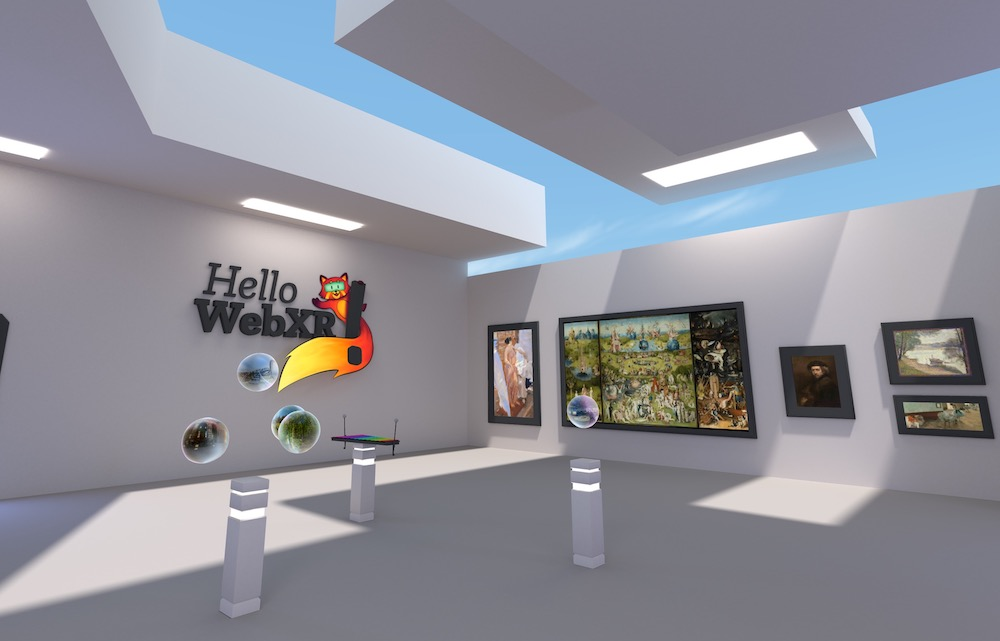

# Hello WebXR!

[Try it here!](https://mixedreality.mozilla.org/hello-webxr/index.html)

This is a WebXR demo made to celebrate the [WebXR spec](https://immersive-web.github.io/webxr/) release at the end of 2019. It showcases several small experiences, perfect to test different kind of interactions and situations in Virtual Reality. For newcomers, it's a nice entry point to the medium, and web developers may find many things they can reuse and learn (more info on the [launch article](https://blog.mozvr.com/hello-webxr)).

## How to build

1. `npm install`
2. `npm start`
3. Open `http://localhost:8080`

### Shader packing

If you make changes to the shaders you'll need to repack them. To keep things simple, we made a simple script `packshaders.py`:

`python packshaders.py [seconds]`

where `seconds` is an optional parameter (defaults to 5) to define how many seconds to wait until next rebuild (doesn't watch file changes)

## Third party content

* Photogrammetry model by Geoffrey Marchal ([Sketchfab](https://sketchfab.com/3d-models/baptismal-angel-kneeling-f45f01c63e514d3bad846e82af640f33))
* 360 Panoramas from [Wikimedia Commons](https://commons.wikimedia.org/wiki/Main_Page):
  * [Halde Zollern](https://commons.wikimedia.org/wiki/File:Halde_Zollern_Panorama_01.jpg)
  * [Lake Byllesby Regional Park](https://commons.wikimedia.org/wiki/File:Lake_Byllesby_Regional_Park_-_360%C2%B0_Equirectangular_Street_View_Photo_(27332591527).jpg)
  * [Kloster Paulinzella, Thüringen](https://commons.wikimedia.org/wiki/File:Kloster_Paulinzella,_Th%C3%BCringen,_360x180,_170316,_ako_(1).jpg)
  * [Tiger And Turtle, Duisburg](https://commons.wikimedia.org/wiki/File:Tiger_And_Turtle_Panorama.jpg)
  * [Zapporthorn, Switzerland](https://commons.wikimedia.org/wiki/File:Zapporthorn_Spherical_Panorama.jpg)
  * [Naturalis Biodiversity Center](https://commons.wikimedia.org/wiki/File:Naturalis_Biodiversity_Center_-_Museum_-_Exhibition_Primeval_parade_33_-_Overview_room_with_skeletons_-_Panorama_360_3D.jpg)
  
* Classical Paintings:
  * [The Garden of Earthly Delights, Hieronymus Bosch](https://commons.wikimedia.org/wiki/File:The_Garden_of_Earthly_Delights_by_Bosch_High_Resolution.jpg)
  * [Self-Portrait, Rembrandt van Rijn](https://www.nga.gov/collection/art-object-page.79.html)
  * [The Dance Lesson, Edgar Degas](https://www.nga.gov/collection/art-object-page.93045.html)
  * [Gray Weather, Grande Jatte, Georges Seurat](https://commons.wikimedia.org/wiki/File:Seurat.jatte.jpg)
  * [The Pink Robe, Joaquin Sorolla](http://sorollapaintings.com/images/sorolla-pink-robe-b-3928.jpg)

* Public Domain sounds from [freesound.org](https://freesound.org)
